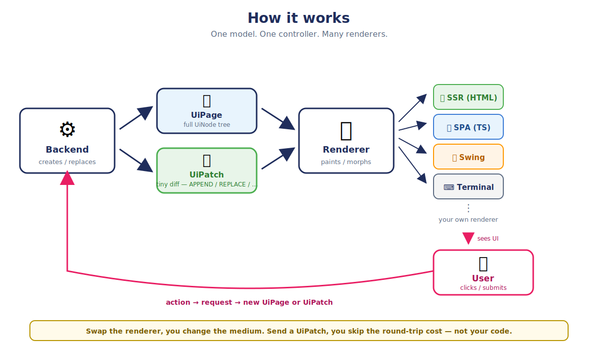

<p align="center">
  <picture>
    <source media="(prefers-color-scheme: dark)" srcset=".github/assets/logo-dark.svg">
    
  </picture>
</p>

<h1 align="center">semantic-ui</h1>

<p align="center"><b>Stop building UIs. Describe them.</b></p>

<p align="center">
  <a href="https://github.com/mindconnect-ai/mc-semantic-ui/actions/workflows/ci.yml"></a>
  <a href="LICENSE"></a>
  
</p>

> With React or Angular you **build** the UI — components, JSX/templates, state,
> hooks, a router, a build step. semantic-ui flips it: you **describe** the
> screen as a small, typed tree of nodes (`UiTable`, `UiForm`, `UiField`, …) and
> a ready-made renderer + CSS design system draws it. No components to write, no
> state to manage, no build toolchain. It runs **fully client-side** (just a
> `<script>` — see the widget showcase) **or** driven by any backend that emits
> JSON.

|                     | React / Angular                 | semantic-ui                                   |
|---------------------|---------------------------------|-----------------------------------------------|
| **You write**       | components (JSX / templates)     | data — a typed `UiNode` tree                  |
| **Markup + logic**  | mixed inside components          | split: model = structure, CSS = look          |
| **State**           | hooks / signals / Redux          | none — UI = `render(your data)`               |
| **Styling**         | per component, drifts over time  | one shared CSS design system                  |
| **Runtime / build** | a framework + toolchain to learn | a `<script>`, or plain JSON                   |
| **Interactivity**   | wire up handlers + state yourself | declarative triggers (fetch / patch / navigate) |



You describe a screen as a tree of typed `UiNode`s (`UiForm`, `UiTable`,
`UiSection`, `UiField`, …) — plain typed data. A small TypeScript renderer turns
that tree into a live, interactive UI in the browser; on the JVM a matching
Handlebars renderer produces the **same** markup as no-JS server HTML, and a
JavaFX renderer draws the very same tree as a native desktop client. One model,
many renderers: a live app, no-JS HTML, a desktop client, and a built-in visual
editor. Where the
data comes from is up to you — a JavaScript object in the page, or any backend
(Java, Node.js, …) that emits the JSON.

## Why

Frontend development has piled up a mental load that's wildly out of proportion
for most CRUD-shaped business apps: build toolchain, reactivity model, state
management, routing, form-state, server-state cache, a component library,
validation — much of it duplicated on both sides of the wire. For an admin,
backoffice or line-of-business UI, that's mostly overhead.

semantic-ui takes a different stance:

- **You write data, not components.** No JSX, no component lifecycle, no
  re-render model to reason about. A `UiTable` literal *is* the table.
- **No state management.** The UI is a pure function of your data — a JavaScript
  object, or a server response. Nothing to keep in sync.
- **Structure is data, design is CSS.** The model says *what* is on screen; your
  CSS says *how it looks*. They can't tangle — you get a consistent design
  system by default instead of styling smeared across components.
- **Logic lives in one place.** Validation, permissions, what-happens-next stay
  where your data is (a backend, or your client code) — never re-implemented in
  a separate frontend.

> The UI of a structured business app is fully describable as a small, typed
> tree. Something emits the tree; a thin renderer and your CSS turn it into the
> UI. Structure is data, design is CSS, logic stays where the data is.

See [`doc/concept.md`](doc/concept.md) for the long-form motivation — where this
is a sweet spot, and where it explicitly isn't.

### Where it fits

- Admin / backoffice
- ERP / CRM / accounting / HR / order entry
- Workflow / wizard / case-management UIs
- B2B SaaS dashboards with tabular data
- Configuration / DevOps surfaces
- LLM-agent-operable UIs (the tree IS the UI contract)

## Modules

| Module                                | What it is                                                                 |
|---------------------------------------|----------------------------------------------------------------------------|
| `core/mc-semantic-ui-core`            | UiNode model + dual renderer (Handlebars SSR + TypeScript SPA bus + CSS)   |
| `core/mc-semantic-ui-javafx`          | Third renderer: the same tree as a native JavaFX desktop client ([README](core/mc-semantic-ui-javafx/README.md)) |
| `ext/mc-semantic-ui-ext-json`         | `UiJsonViewer` — collapsible JSON view (browser-side, auto-config)         |
| `ext/mc-semantic-ui-ext-markdown`     | `UiMarkdown` — Markdown → HTML (browser-side, auto-config)                 |
| `ext/mc-semantic-ui-ext-diagram`      | Diagram extension (canvas-style graph nodes / edges)                       |
| `ext/mc-semantic-ui-ext-chart`        | Chart extension (bar / line / area / pie / donut, SVG)                     |
| `editor/mc-sui-editor`                | Embeddable visual editor (Tree + Property panel + Live preview)            |
| `editor/mc-sui-editor-app`            | Standalone demo for the editor with sample content                         |
| `editor/mc-sui-editor-standalone-app` | Backend-free editor SPA: projects/pages in localStorage, live preview, exports to static / Spring Boot / Node |
| `demo/mc-sui-shop-demo`               | End-to-end demo app: Postgres-backed product CRUD                          |
| `demo/mc-sui-shop-client-demo`        | Backend-free shop: list + detail dialog + upload, driven by client triggers |
| `demo/mc-sui-file-explorer-demo`      | File explorer over the real filesystem, with drag-and-drop `UiUpload`      |
| `demo/mc-sui-node-demo`               | Pure Node.js / Express demo — product list served as plain JSON, no Java   |
| `demo/mc-sui-widget-demo`             | Static, backend-free showcase of every widget (plain JS `UiNode` literals) |

## The core idea in one example

A typed Java tree on the server:

```java
@GetMapping(path = "/admin/products", produces = "application/json,text/html")
public UiPage list(@RequestParam(defaultValue = "") String q,
                   @RequestParam(defaultValue = "0") int page) {

    var table = UiTable.of("products-table", "Products")
            .column(UiColumn.text("sku",  "SKU").asSortable()
                    .withCellTemplate(UiLink.of("sku-link",
                            "/admin/products/{id}", "{sku}")))
            .column(UiColumn.text("name", "Name").asSortable())
            .column(UiColumn.text("price","Price"))
            .rowAction(UiAction.secondary("edit", "Edit")
                    .onClick(UiTrigger.go("/admin/products/{id}/edit")))
            .rowAction(UiAction.danger("delete", "Delete")
                    .confirm("Delete this product?")
                    .dispatch("DELETE", "/admin/products/{id}"));

    productService.findPage(q, page).forEach(p -> table.row(Map.of(
            "id",    p.getId().toString(),
            "sku",   p.getSku(),
            "name",  p.getName(),
            "price", money(p.getPriceCents()))));

    var search = UiForm.of("product-search", null)
            .field(UiField.text("q", "Search", q).asEditable())
            .action(UiAction.primary("search", "Search")
                    .dispatch("GET", "/admin/products"));

    return UiPage.of("/admin/products",
            UiStack.of("product-page-stack").child(search).child(table));
}
```

Three things happen for free:

1. **Browser with `Accept: text/html`** → Spring's HTTP message converter
   walks the tree through `SuiServerRenderer`, which dispatches each node
   to a `<type>.hbs` template, and writes a complete HTML page. No
   JavaScript on the wire, native `<form>` submits, real `<a href>`s.
2. **SPA shell with `Accept: application/json`** → same controller method
   returns the same `UiPage` as JSON. The TS `SuiRenderer` (in
   `core/mc-semantic-ui-core/src/main/ts/renderer.ts`) hands each node to a
   per-type render function (`renderers/form.ts`, `renderers/table.ts`,
   …). The `SuiEventBus` intercepts the `data-trigger` / `data-action`
   attributes, fetches, and **Idiomorph-diffs** the new tree against the
   live DOM — focus and scroll position are preserved.
3. **Editor preview** → the same JSON is what the visual editor reads,
   mutates, and writes back to your store.

There is exactly one source of truth: the Java tree the controller
returned.

## The node vocabulary

18 UiNode types, registered as Jackson `@JsonSubTypes` on the polymorphic
`UiNode` discriminator (`type` field). Each type has a Java class, a
`.hbs` template, and a TS render function — kept symmetric:

| Type             | Purpose                                                |
|------------------|--------------------------------------------------------|
| `page`           | Top-level wrapper; carries optional toasts and dialog  |
| `stack`          | Vertical / horizontal layout box                       |
| `section`        | Tabbed container (each tab is a `section-entry`)       |
| `section-entry`  | One tab + its panel body                               |
| `form`           | `<form>` with fields, actions, links                   |
| `field`          | One input (TEXT / SELECT / DATE / BOOLEAN / FILE / …)  |
| `fieldgroup`     | Titled `<fieldset>` grouping related fields            |
| `upload`         | Drag-and-drop file-upload drop zone                    |
| `action`         | Button or link with `onClick` trigger                  |
| `link`           | Plain navigation link                                  |
| `detail`         | Read-only key/value display                            |
| `list`           | Bulleted / card list of items                          |
| `table`          | Tabular data with columns, rows, row-actions           |
| `column`         | One table column (label + dataKey + optional template) |
| `row`            | One table row (id + data map)                          |
| `chart`          | Placeholder for chart addons                           |
| `header`         | Page-level header (brand + extras + user widget)       |
| `text`           | Bare text node (substitutable in cell templates)       |

Each node has an `id` that flows all the way through: it's the JSON id,
the DOM `id="..."` on the wrapper element, the editor's selection
target, and the trigger anchor for `data-action` / `name=` form fields.

## Three key mechanics that are worth knowing

### Hybrid actions / triggers

A `UiAction` carries an `onClick: UiTrigger { url, method, behavior }`.
The renderer emits **both**:

- A native HTML form (`<form method="…" action="…">` for non-GET
  methods, tunneled through `_method` for DELETE / PUT / PATCH) so the
  browser can use it without JavaScript.
- A `data-trigger='{…}'` attribute the `SuiEventBus` reads when the SPA
  bootstrap script is loaded.

A page upgrades from SSR to SPA by just including the bootstrap script —
no controller change.

### Cell templates

A `UiColumn` can carry a `cellTemplate: UiNode`. For every row the
template is cloned, all string fields are run through `{dataKey}`
substitution against the row's data map, and the resulting node is
rendered through the dispatcher. Same trick works for both renderers.

```java
UiColumn.text("sku", "SKU").withCellTemplate(
        UiLink.of("sku-link", "/admin/products/{id}", "{sku}"));
```

Every row's SKU cell becomes a real navigation link. The substitution
also adds a per-row suffix to nested ids (`sku-link__<row-id>`) so DOM
id uniqueness holds across rows.

### Partial updates with `UiPatch`

A controller doesn't have to return the whole page. A `UiPatch` is a
tiny diff of operations (`REPLACE`, `APPEND`, `CLEAR`, `REMOVE`) that
address nodes by `id`. The SPA renderer applies it via `applyPatch(...)`
— ideal for chatty interactions and streaming (e.g. appending chat
tokens) without re-shipping the full tree.

## Embed it as a UI island

You don't need a full SPA shell. Drop a `<div>` into any existing page,
mount the renderer on it, and attach an event bus so the island is
actually alive:

```html
<link rel="stylesheet" href="/sui/sui.css">
<div id="product-table"></div>
<script type="module">
  import { SuiRenderer, installDefaultHandlers } from "/sui/renderer.js";
  import { SuiEventBus } from "/sui/eventbus.js";

  const host = document.getElementById("product-table");
  const renderer = installDefaultHandlers(new SuiRenderer(host));

  // Without the bus the island is a picture: triggers do nothing.
  // History off — this is someone else's page, not ours.
  const bus = new SuiEventBus(renderer, host).setHistoryEnabled(false);

  const tree = await fetch("/api/products", {
      headers: { Accept: "application/json" } }).then(r => r.json());
  renderer.mount(tree);
</script>
```

`renderer.mount()` paints the tree; the bus is what makes buttons, row
actions and form submits fetch and apply updates — scoped to your
`<div>`. Leave it out only for a genuinely static island.

The host page's layout is untouched; use as many islands as you want —
each gets its own renderer and bus.

See **[Embed as a UI island](https://github.com/mindconnect-ai/mc-semantic-ui/blob/main/website/docs/semantic-ui/ui-island.md)**
for local handlers, patches and the history caveat.

## How it compares

- **HTMX** ships HTML fragments over the wire and swaps them via
  attributes. `semantic-ui` ships a typed JSON tree instead — same
  server-driven idea, but the contract is compile-time-checkable in
  Java / Kotlin / Go, and the renderer (not the controller) owns the
  HTML.
- **Datastar** is the closest neighbour: same sweet spot, also
  HTML-over-the-wire, with SSE-driven reactivity. The trade-off is
  identical to HTMX's — pick `semantic-ui` if you want the contract
  typed; pick Datastar if your team prefers writing markup directly.
- **Inertia.js** keeps a React / Vue / Svelte SPA on the client and
  uses the server only for page props. `semantic-ui` removes the SPA
  framework entirely; the same JSON renders as plain HTML when no JS
  is loaded.
- **Vaadin Flow** runs the component tree on the server with sticky
  WebSocket sessions. `semantic-ui` is stateless: the JSON tree is the
  response to one request, no server-side UI session, no per-user
  RAM cost.

Long-form comparison matrix lives in [`doc/concept.md`](doc/concept.md).

## Quick start — embed it in your Spring Boot app

```xml
<dependency>
  <groupId>ai.mindconnect</groupId>
  <artifactId>mc-semantic-ui-core</artifactId>
  <version>0.0.1-SNAPSHOT</version>
</dependency>
```

Then in your app properties:

```yaml
mindconnect:
  sui:
    ssr:
      enabled: true   # registers the UiPage <-> HTML message converter
```

Auto-configuration (`SuiSsrAutoConfiguration`) wires:
- A `SuiServerRenderer` bean (Handlebars-based)
- The HTTP message converter so controllers can just return `UiPage`
- `HiddenHttpMethodFilter` for `_method` tunneling
- Spring resource handlers for `/sui/*` (the JS bundle + CSS)

Now any `@GetMapping` that returns `UiPage` renders as a full HTML page
in the browser. Mount the `SuiEventBus` in a small `<script>` tag to
upgrade to SPA.

## The visual wysiwyg editor

A built-in visual editor lives in `editor/mc-sui-editor-standalone-app`. It's three
panels:

- **Tree** — Outline of the UiNode tree with add (`+`) and delete (`×`)
- **Property panel** — JSON view of the currently selected node; edits
  apply on blur or Ctrl/Cmd-Enter
- **Live preview** — the actual tree rendered through the SUI renderer.
  Clicks on any rendered element select the corresponding tree node;
  selecting a tab switches the preview into that tab.

The editor is embeddable into your application.


## End-to-end demo: the shop

`demo/mc-sui-shop-demo` is a full Spring Boot CRUD against Postgres:

```bash
cd demo/mc-sui-shop-demo
cp .env.docker.example .env.docker
./start-postgres.sh
mvn spring-boot:run
# then open http://localhost:8080
```

What it demonstrates end-to-end:

- Product list with **search + pagination + per-row actions**
- View / edit / delete via Post/Redirect/Get
- SSR mode (no JS) and SPA mode (load the bootstrap script), switchable
  via a header dropdown — same backend code
- Three themes (light, dark, SBB) swappable via the same dropdown
- A toast after every save, a dialog for inline-edit, a customer tab
  showcasing the tab section

The smoke tests in `PageRenderSmokeTest` lock the markup behaviour of
every interaction.

## Build

This repo is **self-contained** — it carries its own single parent POM
(`parents/mc-semantic-ui-parent`) and does not depend on any other repo.

```bash
# Whole repo (from the root)
mvn clean install -DskipTests

# Or one module, via the reactor root so the shared Node install is reused
mvn -pl core/mc-semantic-ui-core install
```

Java 21 + Spring Boot 3.5. Spring Boot is consumed as a BOM (version
management only), so the `core`/`extensions` libraries stay Spring-free; the
app modules add their own starters. The TS bundle is built by the
`frontend-maven-plugin` (Node pinned at v20.14 in the parent POM).

> **Node install:** the frontend plugin installs Node **once** into a shared
> `.node/` at the repo root (all modules reuse it). On a first, fresh build
> macOS can occasionally fail the very first Node unpack with
> `Could not install Node: …/tmp` (Spotlight/FS locking the temp dir); just
> re-run the build — Node is then present and the install is skipped.

## Project layout

```
mc-semantic-ui/                            — repo root (the build reactor)
├── pom.xml                                — aggregator: module list, parent ref
├── parents/
│   └── mc-semantic-ui-parent/             — the single parent POM (Java 21 +
│                                            Lombok + Spring BOM + Jackson +
│                                            frontend/handlebars); self-contained
├── website/                               — Docusaurus docs (lives in this repo,
│                                            no separate deploy needed)
├── doc/
│   ├── concept.md                         — long-form motivation +
│                                            sweet-spot
│   └── ssr.md                             — SSR / hybrid HTML notes
│
├── core/                                  — the library everything builds on
│   └── mc-semantic-ui-core/               — model + dual renderer
│       ├── src/main/java/.../ui/model/    — UiNode + 16 subtypes
│       ├── src/main/java/.../ui/ssr/      — SuiServerRenderer +
│       │                                    SsrTriggerMapper +
│       │                                    handlebars helpers
│       ├── src/main/resources/
│       │   ├── sui.css                    — base styles
│       │   ├── sui-dark.css / sui-sbb.css — themes
│       │   └── templates/sui/*.hbs        — one template per UiNode
│       └── src/main/ts/
│           ├── model.ts                   — TS interfaces (mirrors Java)
│           ├── renderer.ts                — SuiRenderer + dispatcher
│           ├── renderers/*.ts             — one file per UiNode
│           ├── eventbus.ts                — SuiEventBus (SPA upgrade)
│           └── sui-bootstrap.ts           — entry script for SPA mode
│   └── mc-semantic-ui-javafx/             — the same tree as a desktop client
│       ├── src/main/java/.../javafx/       — SuiFxRenderer + SuiFxEventBus
│       ├── .../javafx/renderers/*.java     — one file per UiNode
│       ├── .../javafx/demo/                — runnable DemoApplication
│       └── src/main/resources/sui-fx/      — sui-fx.css (the FX design system)
│
├── ext/                                   — optional modules; each adds node
│   │                                        types the core can't draw itself
│   ├── mc-semantic-ui-ext-json/         — UiJsonViewer
│   ├── mc-semantic-ui-ext-markdown/     — UiMarkdown
│   ├── mc-semantic-ui-ext-diagram/        — diagram (graph) extension
│   └── mc-semantic-ui-ext-chart/          — chart extension
│
├── editor/
│   ├── mc-sui-editor/                     — embeddable editor starter
│   │   ├── src/main/java/.../editor/      — REST API + NodeRegistry +
│   │                                        content store ports
│   │   └── src/main/ts/                   — editor TS (tree-view,
│   │                                        property-panel, preview, …)
│   └── mc-sui-editor-app/                 — standalone showcase
│
└── demo/
    └── mc-sui-shop-demo/                  — full Postgres-backed shop
```

## Status

Pre-1.0, in active development. Everything in this repo is the reference
implementation — the JSON wire format may still change.

See `doc/todo.md` for the running TODO list and `doc/concept.md` for
the design rationale.

## Support the project

semantic-ui is free and Apache-2.0 licensed, built and maintained by one
person in the open. If it saves you time and you'd like to help keep it going,
a small donation genuinely helps — and is hugely appreciated. ☕

- ☕ **[Buy me a coffee on Ko-fi](https://ko-fi.com/beisdog)**
- 💚 Or hit the **Sponsor** button at the top of the repo.

Not in a position to donate? Starring the repo, filing a good bug report, or
telling a colleague helps just as much. Thank you! 🙏
