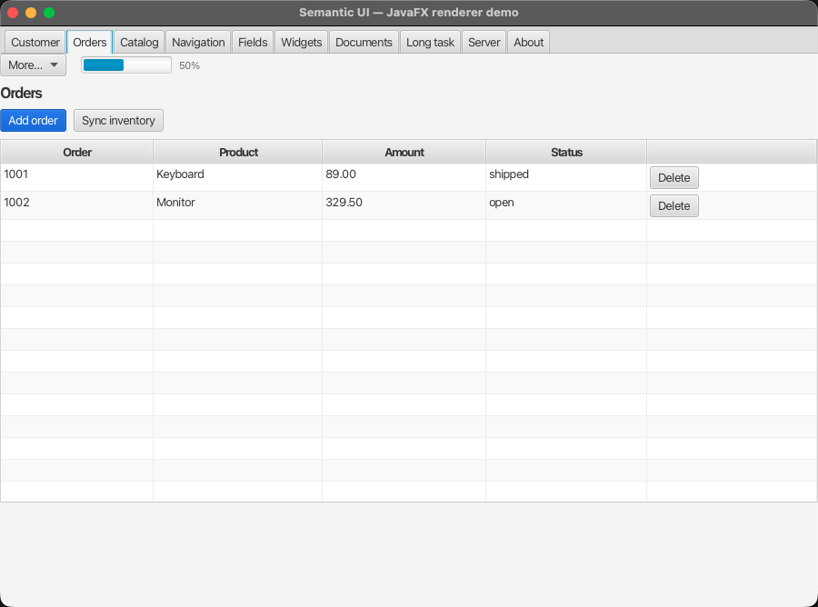

# mc-semantic-ui-javafx

The **third renderer**. The same `UiNode` tree that the core renders as no-JS
server HTML and as a live browser SPA is drawn here as a native **JavaFX desktop
client** — same model, same triggers, same vocabulary, no shared markup.

<!-- One copy of these lives under website/static so the docs site can serve
     them; linking rather than duplicating keeps the two from drifting apart. -->


*A `UiTable` with row actions, a menu button and a progress bar — from the demo
in this module.*

```java
// The overlay is the host ("the DOM"); the renderer paints into it; the bus
// drives the renderer. Same shape as the browser's renderer + SuiEventBus.
var overlay  = new SuiFxOverlay();
var renderer = new SuiFxRenderer().attach(overlay);
var bus      = new SuiFxEventBus(renderer);

bus.registerClientHandler("saveCustomer", ctx -> {
    customerService.save(ctx.payload());       // plain Java, runs off the FX thread
    bus.toast(UiToast.success("Saved."));       // a card, because the overlay is wired
});

renderer.mount(page());
stage.setScene(new Scene(overlay, 900, 640));   // overlay loads sui-fx.css itself
```

`page()` returns a `UiNode` tree. Nothing in it is JavaFX-specific — hand the
same tree to `SuiServerRenderer` and you get HTML.

## Why this exists

The repo's premise is that a UI is *data*, not code. A renderer is then just an
interpreter, and nothing about the model is inherently web-shaped. This module
is the proof: a second, completely unrelated painting technology, driven by the
same tree. What it costs is one class per node type — what it buys is a desktop
client for a screen you already described.

It is not a browser-in-a-window and not a web view. `UiTable` becomes a real
`TableView`, `UiField` a real `TextField`/`ComboBox`/`DatePicker`.

## Run the demo

```bash
mvn -pl core/mc-semantic-ui-javafx javafx:run    # from the repo root
```

Ten tabs covering every supported node, a long-running handler with live
progress, drag-and-drop upload, and a built-in HTTP server (`DemoServer`) whose
endpoints answer with `UiPatch` JSON — including one panel that is filled purely
by the server with **no client handler registered at all**.

> The main class is `DemoLauncher`, which deliberately does *not* extend
> `Application`. A main class that extends `Application` requires `javafx.graphics`
> as a named module and fails on the classpath with *"JavaFX runtime components
> are missing"*. The separate launcher sidesteps that.

## What is supported

18 node types have a renderer (`SuiFxRenderer.installDefaultRenderers`):

| | |
|---|---|
| Layout | `UiStack`, `UiSection` (tabs, each panel in its own scroll pane), `UiFieldGroup` |
| Data | `UiTable` (sorting, row actions, pagination), `UiTree`, `UiDetail`, `UiList` |
| Input | `UiForm`, `UiField` (text, `TEXTAREA`, `NUMBER`, `BOOLEAN`, `DATE`, `SELECT`, `MULTISELECT`, `FILE`), `UiUpload` (drag & drop) |
| Action | `UiAction`, `UiLink`, `UiMenu`, `UiMenuButton` |
| Feedback | `UiText`, `UiDialog`, `UiSpinner`, `UiProgress`, toasts |

Anything else paints a visible placeholder rather than throwing, so an unknown
node degrades instead of taking the window down. Not painted: `UiAppShell`,
`UiHeader`, `UiIcon`, `UiPage`.

Six of the seven `UiTrigger.Behavior`s work: `APPLY_RESPONSE`, `INVOKE`,
`PATCH`, `DOWNLOAD`, `OPEN_IN_TAB`, `UPLOAD`. **`STREAM` is not implemented** —
it is registered as a behaviour that throws, so you get a clear error instead of
silence, and you can register your own.

## Renderer, bus and overlay

Three objects, the same split as the browser:

- **`SuiFxRenderer`** — paints `UiNode`s into a JavaFX scene graph and owns
  mounting: `attach(overlay)`, `mount(tree)`, `applyPatch(...)`. The twin of the
  SPA's `SuiRenderer`.
- **`SuiFxEventBus`** — resolves triggers, runs handlers, routes toasts. Driven
  by a renderer: `new SuiFxEventBus(renderer)`. The twin of `SuiEventBus`.
- **`SuiFxOverlay`** — the host surface ("the DOM"): the scene root the renderer
  paints into, and where toasts and the busy scrim live. It loads `sui-fx.css`
  itself.

If the renderer was `attach`ed to an overlay, the bus wires toasts and busy
state to it automatically — no `setOverlay` call.

**Handlers are plain Java and run off the FX thread.** A handler is a lambda
taking an `FxTriggerContext`; the bus hops back to the FX thread for you when it
applies the result, so a slow handler never freezes the window.

```java
bus.registerClientHandler("importCatalog", ctx -> { … });                   // background (default)
bus.registerClientHandler("pickColor", ctx -> { … }, FxHandlerThread.FX);   // needs the FX thread
```

**Payload resolution is "nearest wins"**: an explicit payload id, else the
`UiRow` the trigger sits in (so a row action carries its own row), else the
enclosing form's values — collected across arbitrary nesting, and across
unselected tabs, because tab panels are painted eagerly.

**Busy state is honest at three levels**: the clicked control, a global scrim
(delayed 250 ms so fast handlers never flash it), and the declarative
`UiAction.loading` flag.

`applyPatch(UiPatch)` applies `REPLACE`/`APPEND`/`CLEAR`/`REMOVE` against the
live scene graph via an id→`Node` index — the same patches the browser gets.

## Styling

`src/main/resources/sui-fx/sui-fx.css` is the FX counterpart of `sui.css`. Every
node gets a `sui-<type>` style class, so the JavaFX CSS selectors read like the
web ones (`.sui-table`, `.sui-action`, `.is-loading`).

## Known limits

Honest list, not a roadmap:

- `UiPatch` `REPLACE` needs the target's parent to be a `Pane`. Tab content is
  not, which is why the demo wraps patch targets in a `UiStack`.
- Icons are ignored everywhere — there is no sprite-sheet equivalent.
- **`UiMenu.State.RAIL` collapses the menu instead of narrowing it to a strip.**
  A rail is a column of icons, and there are none, so a strip could only show
  truncated labels. With `toggle` the hamburger button stays behind so the menu
  can be reopened; without one, `RAIL` behaves like `HIDDEN`. This is the one
  place where the same model looks different here than in the browser.
- `UiField`'s `CURRENCY`, `PERCENT`, `DATETIME` and `REFERENCE` fall back to a
  plain text field; `min`/`max`/`step` are carried but not enforced.
- `UiColumn.cellTemplate` is not applied.
- `UiMenu.Mode`/`Side` and tab overflow are ignored.
- Pagination fires without a target page — a model-level gap that affects all
  three renderers, not just this one.

## Tests

```bash
mvn -pl core/mc-semantic-ui-javafx test
```

25 tests. They need a windowing system: OpenJFX ships no headless backend, so on
a display-less machine they **skip themselves** rather than fail. CI therefore
runs the build under `xvfb-run` — otherwise a green check would only mean
"compiles" while every test silently skipped.
