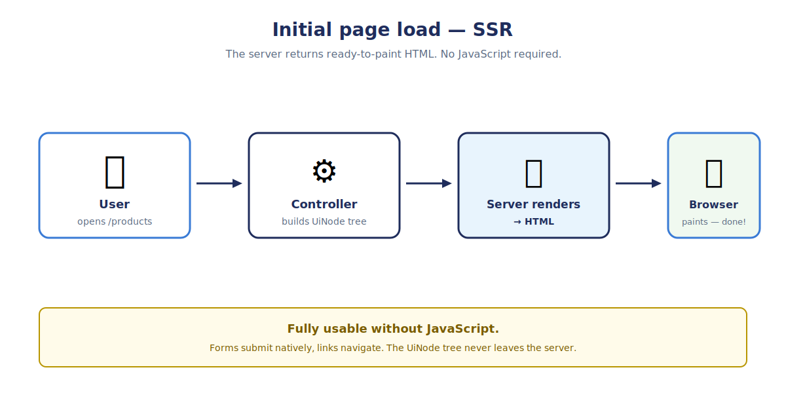
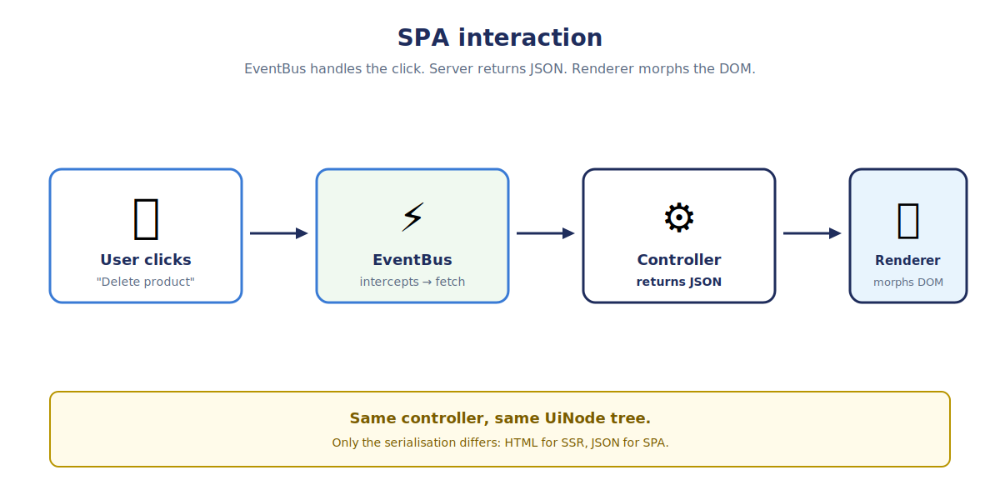
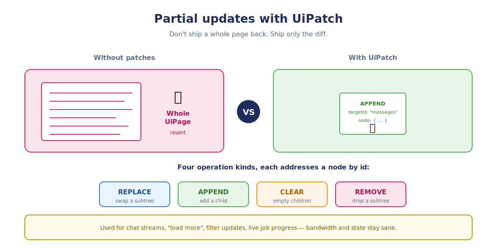
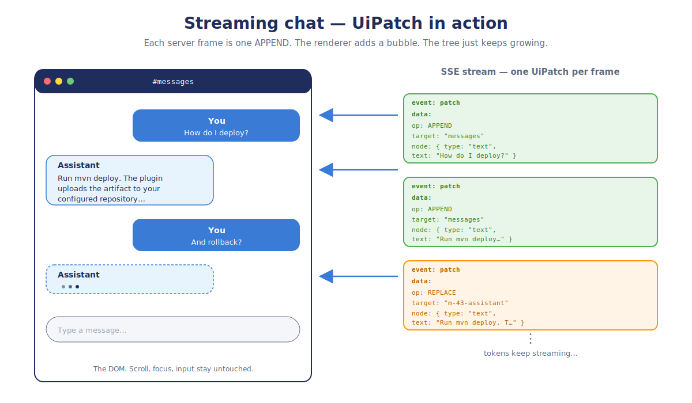

<!--
  Render with Marp:
    npx @marp-team/marp-cli@latest presentation.md -o presentation.html
    npx @marp-team/marp-cli@latest presentation.md -o presentation.pdf
    npx @marp-team/marp-cli@latest presentation.md -o presentation.pptx

  In VS Code: install the "Marp for VS Code" extension and the file
  renders live in the preview pane.
-->

<!-- _class: lead -->

# semantic-ui

Modern UIs without the modern complexity.

<br>

Same model renders to plain HTML,
to a live SPA, or through your own custom renderer.

<br>

*Old school principles.
For sane, maintainable UIs.*

<br>

**David Beisert**

---

# The problem

As a **business developer**, I care about
**data and operations** — not stylesheets,
flex layouts, or reactivity models.

Today's frontend stack forces me into all of them:

- Pick a CSS framework. Then fight it.
- Manage form state. And server state. And URL state.
- Wire validation. Twice — client and server.
- Mix layout, styling, and business logic in the same file.

> Modern frontend frameworks have **forgotten what
> separation of concerns means.**

That's the problem `semantic-ui` solves.

---

# Why modern frontend frameworks fail us

<div class="columns">

<div>

- **JSX mixes logic and UI**
  *— components are 200 lines of switch
    statements, props drilling, and JSX
    soup. Where is the actual feature?*
- **State handling is a science**
  *— signals, hooks, stores, contexts,
    reducers, providers. Pick wrong,
    rewrite later.*
- **What happened to WYSIWYG editors?**
  *— Delphi, VB6, WinForms,
    Swing/NetBeans Matisse had
    drag-and-drop form designers.
    Modern web? Hand-write JSX??*
- **Huge bundle sizes**
  *— a "simple" admin page ships
    hundreds of KB of JavaScript
    before any business value.*

</div>

<div>

- **`npm install` is a security event**
  *— hundreds of transitive dependencies,
    nightly CVEs, supply-chain attacks.*
- **Constant version churn**
  *— React 17 → 18 → 19, Next 12 → 13 →
    14 → 15. Migrations every quarter.*
- **Build toolchain madness**
  *— webpack, vite, rollup, esbuild,
    swc, turbopack. Each project picks
    differently.*
- **The fullstack myth**
  *— "everyone does both" sounds nice
    but means everyone does both badly.
    Frontend is its own discipline.*

</div>

</div>

<br>

> **The result:** mental overload.
> A backend dev spends more time
> fighting the frontend stack than
> building features.

<br>

> We just want to ship business apps.

---

# The reality — a checkbox in Angular

A child toggles a checkbox. Its value must reach the
grandparent and persist in a shared service.

<div class="columns">

<div>

### 4× event bubbling

```typescript
// 1. Leaf child
@Component({ template: `
  <input type="checkbox"
         [checked]="selected"
         (change)="toggled.emit($event.target.checked)">
`})
class CheckboxCell {
  @Input()  selected = false;
  @Output() toggled  = new EventEmitter<boolean>();
}

// 2. Row component
@Component({ template: `
  <checkbox-cell [selected]="row.selected"
                 (toggled)="onToggle($event)">
  </checkbox-cell>
`})
class RowComp {
  @Input()  row!: Row;
  @Output() rowToggled = new EventEmitter<Row>();
  onToggle(v: boolean) {
    this.row.selected = v;
    this.rowToggled.emit(this.row);
  }
}

// 3. Table component — bubble again
@Component({ template: `
  <row-comp *ngFor="let r of rows"
            [row]="r"
            (rowToggled)="onRowToggled($event)">
  </row-comp>
`})
class TableComp {
  @Input()  rows!: Row[];
  @Output() selectionChanged = new EventEmitter<Row[]>();
  onRowToggled(r: Row) {
    this.selectionChanged.emit(
      this.rows.filter(x => x.selected));
  }
}

// 4. Page — finally subscribe
@Component({ template: `
  <table-comp [rows]="rows$ | async"
              (selectionChanged)="onSel($event)">
  </table-comp>
`})
class PageComp { /* … */ }
```

</div>

<div>

### Shared state + Observable plumbing

```typescript
// Service holding the source of truth
@Injectable({ providedIn: 'root' })
class SelectionService {
  private subj = new BehaviorSubject<Row[]>([]);
  readonly selected$ = this.subj.asObservable();

  setSelected(rows: Row[]) { this.subj.next(rows); }
  clear()                  { this.subj.next([]);   }
}

// Page glues it all together
@Component({ /* … */ })
class PageComp implements OnInit, OnDestroy {
  rows$!: Observable<Row[]>;
  // Signal for "are we busy?" — different system
  readonly busy = signal(false);
  private destroy$ = new Subject<void>();

  constructor(
    private http: HttpClient,
    private sel:  SelectionService,
    private fb:   FormBuilder) {
    // Effect — yet another reactive primitive
    effect(() => {
      const b = this.busy();
      document.body.classList.toggle('loading', b);
      if (b) console.debug('loading…');
    });
  }

  ngOnInit() {
    const filter$ = this.fb.control('').valueChanges
      .pipe(debounceTime(250),
            distinctUntilChanged(),
            startWith(''));

    this.rows$ = combineLatest([
      filter$,
      this.sel.selected$,
      this.http.get<Row[]>('/api/rows')
        .pipe(tap(() => this.busy.set(false)))
    ]).pipe(
      tap(() => this.busy.set(true)),
      map(([q, sel, all]) =>
        all.filter(r => r.name.includes(q))
           .map(r => ({...r,
              selected: sel.some(s => s.id === r.id)}))),
      takeUntil(this.destroy$));
  }

  onSel(rows: Row[]) { this.sel.setSelected(rows); }

  ngOnDestroy() {
    this.destroy$.next();
    this.destroy$.complete();
  }
}
```

</div>

</div>

> Five classes. Four `@Output` chains. Three reactive
> primitives — Observable, Signal, Effect — wired together.
> One Subject for cleanup. **All to track which checkbox is ticked.**

---

# The thesis

I describe my UI at an **abstract level**:
*"a table of products with these columns and these actions."*

The renderer takes care of **how it looks**.
Default styling is good enough out of the box.
Want to change it? **One CSS file**, or swap the renderer
for a custom one. Never touch business code.

<br>

**Clean separation:**

- Developer writes **structure + behaviour**.
- Designer owns **stylesheets + renderer**.
- Multiple output formats fall out of the same model
  **for free** — SSR HTML, SPA, a Swing desktop client,
  native mobile, even a terminal UI.

<br>

> No spaghetti. Real separation of concerns.

---

# How it works

Three pieces. **One model. One controller. Many renderers.**

<br>

```
   Controller          UiNode tree             Renderer
  ┌──────────┐        ┌──────────┐        ┌──────────────┐
  │  Spring  │ ─────▶ │  UiPage  │ ─────▶ │  SSR (HTML)  │
  │  @GetMap │        │  UiForm  │        │  SPA (TS)    │
  │   load() │        │  UiTable │        │  Swing       │
  └──────────┘        └──────────┘        │  …           │
                                          └──────────────┘
       ▲                                          │
       └──────────────────────────────────────────┘
              user action (form post / click)
```

<br>

The **controller builds the tree**. The **renderer paints it**.
Swap the renderer, you change the medium — not your code.

---

# Example: a product list — controller

```java
@GetMapping(path = "/admin/products",
            produces = "application/json,text/html")
public UiPage list(@RequestParam(defaultValue = "") String q,
                   @RequestParam(defaultValue = "0") int page) {

    var table = UiTable.of("products-table", "Products")
        .column(UiColumn.text("sku",   "SKU").asSortable()
                .withCellTemplate(UiLink.of("sku-link",
                        "/admin/products/{id}", "{sku}")))
        .column(UiColumn.text("name",  "Name"))
        .column(UiColumn.text("price", "Price"))
        .rowAction(UiAction.danger("delete", "Delete")
                .confirm("Delete this product?")
                .dispatch("DELETE", "/admin/products/{id}"));

    productService.findPage(q, page).forEach(p -> table.row(Map.of(
            "id",  p.getId().toString(), "sku", p.getSku(),
            "name", p.getName(), "price", money(p.getPriceCents()))));

    return UiPage.of("/admin/products", table);
}
```

---

# What the same code produces

<div class="columns">

<div>

### SSR mode (no JavaScript)

```html
<table class="sui-table" id="products-table">
  <thead><tr>
    <th id="col-sku">SKU</th>
    <th id="col-name">Name</th>
    <th id="col-price">Price</th>
    <th></th>
  </tr></thead>
  <tbody>
    <tr id="abc-123">
      <td><a href="/admin/products/abc-123"
             data-trigger='{"url":"…"}'
             >X-1</a></td>
      <td>Office Chair</td>
      <td>299,00 €</td>
      <td><form method="post"
                action="/admin/products/abc-123">
        <input type="hidden" name="_method"
               value="DELETE">
        <button>Delete</button>
      </form></td>
    </tr>
  </tbody>
</table>
```

</div>

<div>

### SPA mode (same JSON tree)

```json
{
  "type": "table",
  "id": "products-table",
  "columns": [
    { "type": "column", "id": "col-sku",
      "label": "SKU",
      "cellTemplate": {
        "type": "link",
        "href": "/admin/products/{id}",
        "label": "{sku}"
      }
    },
    { "type": "column", "label": "Name" }
  ],
  "rows": [
    { "type": "row", "id": "abc-123",
      "data": {"sku": "X-1",
               "name": "Office Chair",
               "price": "299,00 €"}
    }
  ]
}
```

</div>

</div>

---

# Server-side rendering

The controller assembles the **UiNode tree** →
`SuiServerRenderer` turns it into HTML on the JVM.

**Browser gets a finished page** — no JavaScript required.
Forms and links work natively.

---

<!-- _class: diagram -->



---

# Single-page application

The **EventBus** intercepts clicks on `[data-trigger]`
elements. The **same controller** returns the new
`UiPage` as JSON.

The browser-side `SuiRenderer` runs each node through its
TS handler; **Idiomorph diffs** the result against the live
DOM — focus and scroll position preserved.

---

<!-- _class: diagram -->



---

# Backend in any language — Node.js example

The protocol is **plain JSON**. Any backend that
can produce the tree shape works — Java, Kotlin,
Python, Go, Rust, **Node.js**.

```js
// Express.js: serve the same UiPage to browsers (HTML)
// and SPA clients (JSON), based on the Accept header.
import express from "express";
import { renderToHtml } from "./sui-ssr.js";   // optional helper
const app = express();

app.get("/products", async (req, res) => {
  const rows = await db.findProducts(req.query.q);

  const tree = {
    type: "page",
    navigate: "/products",
    node: {
      type: "table", id: "products-table",
      columns: [
        { type: "column", id: "col-sku",  label: "SKU",
          dataKey: "sku",
          cellTemplate: { type: "link", id: "sku-link",
                          href: "/products/{id}", label: "{sku}" } },
        { type: "column", id: "col-name", label: "Name",  dataKey: "name"  },
        { type: "column", id: "col-price",label: "Price", dataKey: "price" }
      ],
      rows: rows.map(r => ({ type: "row", id: r.id, data: r })),
      rowActions: [
        { type: "action", id: "delete", label: "Delete", style: "DANGER",
          onClick: { url: "/products/{id}", method: "DELETE" } }
      ]
    }
  };

  res.format({
    "application/json": () => res.json(tree),
    "text/html":        () => res.send(renderToHtml(tree))
  });
});
```

Same controller, same tree — content negotiation
does the rest. **No semantic-ui code on the server**,
just the JSON shape.

---

# Easy to embed — UI islands in any page

You don't need a full-blown SPA shell.
**Drop a `<div>`** into any HTML page and mount
the `SuiRenderer` on it:

```html
<link rel="stylesheet" href="/sui/sui.css">

<h1>My existing page</h1>
<p>Some content rendered by my CMS / framework / whatever.</p>

<div id="product-table"></div>

<script type="module">
  import { SuiRenderer, installDefaultHandlers } from "/sui/renderer.js";

  const host = document.getElementById("product-table");
  const renderer = installDefaultHandlers(new SuiRenderer(host));

  const tree = await fetch("/api/products", {
      headers: { Accept: "application/json" }
  }).then(r => r.json());

  renderer.mount(tree);
</script>
```

That's it — **the host page's layout is untouched**,
the `<div>` becomes a live UiNode island.
Use as many islands as you want.

---

# Partial updates with `UiPatch`

Don't always ship the whole page back —
a `UiPatch` is a **tiny diff** of operations
addressing nodes by `id`.

---

<!-- _class: diagram -->



---

<!-- _class: diagram -->



---

# The vocabulary — 16 UiNode types

| **Containers**     | **Inputs**         | **Display**        |
|--------------------|--------------------|--------------------|
| `page`             | `field`            | `text`             |
| `stack`            | `action`           | `chart`            |
| `section`          | `link`             | `header`           |
| `section-entry`    |                    |                    |
| `form`             |                    |                    |
| `detail`           | **Table parts**    |                    |
| `list`             | `column`           |                    |
| `table`            | `row`              |                    |

Each type: **Java class + Handlebars template + TypeScript renderer.**
Kept symmetric — adding a node means adding all three.

---

# Easy to extend

The core ships **16 node types**. Need more?
**Drop in a new node + renderer.** No core change.

<br>

**Example — server-side diagram rendering:**

```
ext/mc-semantic-ui-ext-diagram/
  ├─ UiDiagram.java        ← @JsonTypeName("diagram")
  │                          nodes, edges, layout hints
  ├─ diagram.hbs            ← server-side template
  └─ renderers/diagram.ts   ← browser-side SVG painter
```

The backend pre-computes a diagram **as data**
(nodes, edges, positions). The renderer turns it into
SVG — server, browser, or PDF, your pick.

<br>

| **Same pattern works for:** |
|--|
| Markdown viewer · JSON viewer · Charts · Workflow editors · Custom domain widgets |

---

# The visual editor (WYSIWYG)

A built-in editor lives in `editor/mc-sui-editor` —
three panels, embeddable into any app.

Because the **UI model** and the **renderer** are separate,
the WYSIWYG was trivial to implement.

<div class="columns">

<div>

### Tree
Outline of the UiNode tree.
Add and delete nodes by type.

### Property panel
JSON editor of the selected node.

</div>

<div>

### Live preview
Renders through the same SUI renderer
as production just the events are disabled.

</div>

</div>

---

# How it compares

|  | **HTMX** | **Datastar** | **Inertia.js** | **Vaadin Flow** | **semantic-ui** |
|---|---|---|---|---|---|
| What ships over the wire | rendered HTML | rendered HTML + signals | JSON props for a SPA framework | server components | **abstract UI model (typed JSON)** |
| Renderer is             | the browser     | the browser     | the SPA framework  | locked in            | **swappable / pluggable**     |
| Client-side state       | none            | signals         | SPA-framework      | none (on server)     | minimal                 |
| Backend language        | any             | any             | any                | Java only            | any (JSON)              |
| Type-safe contract      | no              | no              | partial            | yes                  | yes                     |

**The real difference:** HTMX and Datastar ship **already-rendered HTML**.
We ship an **abstract UI model** the renderer interprets — so the same
model can become HTML today, a Swing UI tomorrow, a terminal app after that.

---

# A trivial edit form — in React

Load a product, edit name + price, save, show errors.

<div class="columns">

<div>

### Component + hooks

```tsx
function ProductForm({ id }) {
  const [data,    setData]    = useState(null);
  const [errors,  setErrors]  = useState({});
  const [saving,  setSaving]  = useState(false);
  const [touched, setTouched] = useState({});

  useEffect(() => {
    fetch(`/api/product/${id}`)
      .then(r => r.json())
      .then(setData);
  }, [id]);

  const validate = (d) => {
    const errs = {};
    if (!d.name)      errs.name  = "Required";
    if (d.price < 0)  errs.price = "Negative";
    return errs;
  };

  const onChange = (field) => (e) => {
    const next = { ...data, [field]: e.target.value };
    setData(next);
    setErrors(validate(next));
    setTouched({ ...touched, [field]: true });
  };

  const onSave = async (e) => {
    e.preventDefault();
    setSaving(true);
    const res = await fetch(`/api/product/${id}`, {
      method: "PUT",
      body: JSON.stringify(data),
    });
    if (!res.ok) setErrors(await res.json());
    setSaving(false);
  };
```

</div>

<div>

### JSX template

```tsx
  if (!data) return <Spinner />;
  return (
    <form onSubmit={onSave} noValidate>
      <label>
        Name
        <input value={data.name}
               onChange={onChange("name")}
               onBlur={() => setTouched(
                 {...touched, name: true})} />
        {touched.name && errors.name &&
          <span className="err">
            {errors.name}
          </span>}
      </label>

      <label>
        Price
        <input type="number"
               value={data.price}
               onChange={onChange("price")}
               onBlur={() => setTouched(
                 {...touched, price: true})} />
        {touched.price && errors.price &&
          <span className="err">
            {errors.price}
          </span>}
      </label>

      <button type="submit"
              disabled={saving}>
        {saving ? "Saving…" : "Save"}
      </button>
    </form>
  );
}
```

</div>

</div>

---

# The same form — in `semantic-ui`

```java
@GetMapping("/products/{id}")
UiPage edit(@PathVariable Long id) {
  Product p = repo.findById(id).orElseThrow();
  String url = "/products/" + id;

  return UiPage.of(url,
    UiForm.of("edit", "Edit product")
      .field(UiField.text  ("name",  "Name",  p.getName()))
      .field(UiField.number("price", "Price", p.getPrice()))
      .action(UiAction.primary("save", "Save")
        .onClick(UiTrigger.api("POST", url, "edit")))
  );
}

@PostMapping("/products/{id}")
UiPage save(@PathVariable Long id, @Valid Product p) {
  repo.save(p);
  return edit(id);
}
```

<br>

> No `useState`. No `useEffect`. No fetch glue.
> No `error`-state plumbing. **Bean Validation
> already speaks the language of forms.**

---

# The same form — in Angular

`FormGroup`, `HttpClient`, lifecycle, plus a template file.

<div class="columns">

<div>

### `product-form.component.ts`

```typescript
@Component({
  selector:    'product-form',
  templateUrl: './product-form.html',
})
export class ProductForm implements OnInit, OnDestroy {
  form = this.fb.group({
    name:  ['', Validators.required],
    price: [0,  Validators.min(0)],
  });
  saving = false;
  errors: Record<string,string> = {};
  private destroy$ = new Subject<void>();

  constructor(private fb:    FormBuilder,
              private http:  HttpClient,
              private route: ActivatedRoute) {}

  ngOnInit() {
    const id = this.route.snapshot.params['id'];
    this.http.get<Product>(`/api/product/${id}`)
      .pipe(takeUntil(this.destroy$))
      .subscribe(p => this.form.patchValue(p));
  }

  onSave() {
    this.saving = true;
    const id = this.route.snapshot.params['id'];
    this.http.put(`/api/product/${id}`, this.form.value)
      .pipe(takeUntil(this.destroy$))
      .subscribe({
        next:  () => this.saving = false,
        error: e  => {
          this.errors = e.error;
          this.saving = false;
        },
      });
  }

  ngOnDestroy() {
    this.destroy$.next();
    this.destroy$.complete();
  }
}
```

</div>

<div>

### `product-form.html`

```html
<form [formGroup]="form" (ngSubmit)="onSave()">
  <label>
    Name
    <input formControlName="name" />
    <span *ngIf="form.get('name')?.touched
              && form.get('name')?.errors?.['required']"
          class="err">
      Required
    </span>
    <span *ngIf="errors['name']" class="err">
      {{ errors['name'] }}
    </span>
  </label>

  <label>
    Price
    <input type="number" formControlName="price" />
    <span *ngIf="form.get('price')?.touched
              && form.get('price')?.errors?.['min']"
          class="err">
      Must be positive
    </span>
    <span *ngIf="errors['price']" class="err">
      {{ errors['price'] }}
    </span>
  </label>

  <button type="submit"
          [disabled]="saving || form.invalid">
    {{ saving ? "Saving…" : "Save" }}
  </button>
</form>
```

</div>

</div>

---

# The same form — in `semantic-ui`

```java
@GetMapping("/products/{id}")
UiPage edit(@PathVariable Long id) {
  Product p = repo.findById(id).orElseThrow();
  String url = "/products/" + id;

  return UiPage.of(url,
    UiForm.of("edit", "Edit product")
      .field(UiField.text  ("name",  "Name",  p.getName()))
      .field(UiField.number("price", "Price", p.getPrice()))
      .action(UiAction.primary("save", "Save")
        .onClick(UiTrigger.api("POST", url, "edit")))
  );
}

@PostMapping("/products/{id}")
UiPage save(@PathVariable Long id, @Valid Product p) {
  repo.save(p);
  return edit(id);
}
```

<br>

> No `FormBuilder`. No `FormGroup`. No subscription.
> No template file. **Validation rules already live
> on `Product`.**

---

# For tech leads & architects

<div class="columns">

<div>

### Scales horizontally

Backend stays stateless. No sticky sessions,
no per-user RAM. Horizontal scale is whatever
your Spring app already does. UiPatch keeps
payloads small even for chatty interactions.

### Super Easy to test

UiPage is a plain Java object — assert the
tree directly. No headless browser, no Selenium,
no flakiness.

</div>

<div>

### Maintained by your backend devs

16 types. No framework churn — no React-17→18→19
migrations to plan for. The Java compiler enforces
the contract. 

### No lock-in worth fighting

The model is JSON. The renderer is swappable.
Your business code never moves.

</div>

</div>

---

# Where it shines

<div class="columns">

<div>

### Business software

- Internal admin / back-office
- ERP / CRM / accounting / HR
- Order entry, invoicing
- Workflow UIs, application flows
- B2B-SaaS dashboards
- Shop back-offices
- Configuration / DevOps surfaces

</div>

<div>

### Modern use cases

- **LLM-agent-operable UIs**
  *— a finite vocabulary is much
    easier for an agent to drive than HTML*
- **Dynamic UIs**
  *— UI shape changes per user, per
    role, per workflow state. The tree
    is just data — assemble it.*
- Realtime chat
- Multi-channel apps
  *— same model on web, desktop, mobile*

</div>

</div>

<br>

> Anywhere a backend team wants to ship
> structured, data-driven UIs **fast** —
> without becoming a frontend team first.

---

# Why I built it

**Honestly? For myself first.**

After 26 years of writing backends, **frontend
development always felt wrong** to me — through
every generation. JSP, jQuery, Backbone, React,
Angular 1, Angular 2… each one added layers
without removing the discomfort.

At some point I stopped trying to *fit in* and
decided to **build the thing I actually wanted**:

> A way to describe a business UI **once** — in the
> language I already think in — and let a renderer
> deal with the rest.

<br>

That's all `semantic-ui` is. **An honest tool for honest apps —**
optimised for the team that has to maintain it.

---

# What's in the repo

```
mc-semantic-ui/
├── core/mc-semantic-ui-core/             ← model + dual renderer (Java + TS)
│   ├── model/                       ← 16 UiNode types
│   ├── ssr/                         ← Handlebars server renderer
│   ├── ts/renderer.ts + renderers/  ← TS dispatcher + per-type files
│   └── templates/sui/*.hbs          ← one template per UiNode
├── ext/mc-semantic-ui-ext-json/         ← UiJsonViewer
├── ext/mc-semantic-ui-ext-markdown/     ← UiMarkdown
├── ext/mc-semantic-ui-ext-diagram/      ← graph / diagram extension
├── ext/mc-semantic-ui-ext-chart/        ← chart extension
├── editor/mc-sui-editor/            ← embeddable visual editor
├── editor/mc-sui-editor-app/        ← standalone editor showcase
└── demo/mc-sui-shop-demo/           ← Postgres-backed product CRUD
```

**Run it:**

```bash
cd demo/mc-sui-shop-demo
./start-postgres.sh && mvn spring-boot:run
# then http://localhost:8080
```

---

# Quick-start in your Spring Boot app

```xml
<dependency>
  <groupId>ai.mindconnect</groupId>
  <artifactId>mc-semantic-ui-core</artifactId>
  <version>0.1.0-SNAPSHOT</version>
</dependency>
```

```yaml
mindconnect:
  sui:
    ssr:
      enabled: true   # registers the UiPage <-> HTML converter
```

Then any controller that returns `UiPage` automatically
serves HTML for browsers and JSON for SPA clients —
no per-controller change.

---

<!-- _class: lead -->

# Thanks

**Code**: `github.com/mindconnect-ai/mc-semantic-ui`
**Concept doc**: [`doc/concept.md`](concept.md)
**SSR design**: [`doc/ssr.md`](ssr.md)

<br>

*Questions?*
